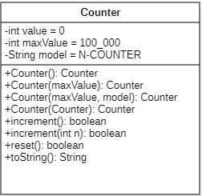

# Ejercicio JUnit


## ¿Qué es este repositorio?
Este repositorio corresponde a un ejercicio propuesto en clase para aprender a utilizar JUnit.

## Requisitos

1.Crea una clase llamada **Counter** en el paquete **mipaquete** dentro de la jerarquía correspondiente en Maven con:



  #### Propiedades:
  * **value**: Valor del contador (en todo el proceso debe asegurarse que no toma valores negativos ni supera el valor máximo establecido). Valor por defecto 0.
    
  * **maxValue**: Valor máximo -> Por defecto 100_000.
    
  * **model**: Modelo -> Por defecto "N-COUNTER".

  #### Constructores:
  * Sin parámetros.
    
  * Dado **maxvalue**.
    
  * Dados **maxValue** y **model**.
    
  * Contructor copia.

  #### Métodos:
  * **toString()** muestra la información del **counter** como en el ejemplo:
    ```diff
    Contador modelo: N-COUNTER
    Valor actual: 0
    Valor máximo: 100000

  * **boolean increment()**: Incrementa en 1 **value** y devuelve true si se ha podido incrementar y false si no se ha podido incrementar por estar ya en el valor máximo.
    
  * **boolean increment(int n)**: Incrementa en ***n*** el valor (devuelve false si NO se ha incrementado todas las unidades indicadas por haber llegado al límite). En caso de introducir un valor menor o igual que 0 deberá lanzar **IllegalArgumentException**.
    
  * **boolean reset()**: Poner el contador a 0, pero solo en el caso de que tenga el valor máximo (en ese caso devuelve true), en caso contrario false.
    
  * **Métodos getter y setter**: Crea los que consideres oportunos para poder probar el funcionamiento de la clase.

2.Crea una clase llamada **CounterTest** en el paquete **mipaquete** dentro de la jerarquía correspondiente en Maven.
  * Asegúrate de comprobar mediante la función **Coverage** que cubrimos el 100% de la clase **Counter**.
